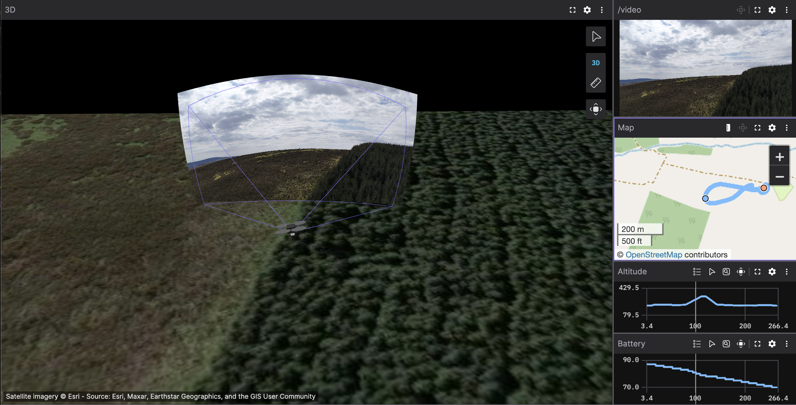

# djicap

Convert DJI flight records and recorded video/photos to [Foxglove](https://foxglove.dev) `.mcap` files for telemetry visualisation.



## Topics written

| Topic | Schema | Content |
|---|---|---|
| `/dji/osd` | `dji.OSD` | Position, attitude, speed, GPS, flight mode |
| `/dji/gimbal` | `dji.Gimbal` | Gimbal pitch/roll/yaw, limit flags |
| `/dji/battery` | `dji.Battery` | Voltage, current, charge level, cell voltages |
| `/dji/rc` | `dji.RC` | Stick inputs, uplink/downlink signal |
| `/dji/home` | `dji.Home` | Home point, height limit |
| `/foxglove/map_origin` | `foxglove.LocationFix` | GPS anchor for the 3D scene (emitted once) |
| `/foxglove/gps` | `foxglove.LocationFix` | GPS trace — use with the Map panel |
| `/foxglove/drone/tf` | `foxglove.FrameTransform` | Drone body pose in ENU (`world` → `base_link`) |
| `/foxglove/gimbal/tf` | `foxglove.FrameTransform` | Gimbal orientation (`base_link` → `gimbal_link`) |
| `/foxglove/camera/tf` | `foxglove.FrameTransform` | Camera optical frame (`gimbal_link` → `camera`) |
| `/joint_states` | `sensor_msgs/JointState` | Gimbal joint angles driving the URDF model |
| `/robot_description` | `std_msgs/String` | DJI Mini 4 Pro URDF (emitted once) |
| `/video` | `foxglove.CompressedVideo` | H.264/H.265 video packets (with `--media`) |
| `/image` | `foxglove.CompressedImage` | JPEG/PNG photos (with `--media`) |
| `/camera/camera_info` | `foxglove.CameraCalibration` | Approximate Mini 4 Pro intrinsics (with `--media`) |

## Usage

```bash
djicap <input.txt> [options]
```

| Option | Description |
|---|---|
| `--output <file>` | Output path (defaults to `<input>.mcap`) |
| `--api-key <key>` | DJI Open API key for v13+ log decryption |
| `--media <dir>` | Directory of MP4/JPG files to embed alongside telemetry |
| `--scale <width>` | Transcode video to H.264 at this pixel width (reduces MCAP size for 4K HEVC) |
| `--video-offset <secs>` | Shift video/image timestamps by this many seconds (positive = later) |

**Example — telemetry only:**

```bash
djicap FlightRecord_2026-04-25_\[12-16-41\].txt
```

**Example — with embedded video:**

```bash
djicap FlightRecord_2026-04-25_\[12-16-41\].txt --media Video/
```

Media files are matched to the flight time window automatically using the MP4's `creation_time` metadata and DJI filename timestamps.

### Video offset

DJI sets `creation_time` when recording initialises, a couple of seconds before the first frame is captured. Use `--video-offset` to correct the alignment:

```bash
djicap FlightRecord.txt --media Video/ --video-offset 2.5
```

### H.265 / HEVC transcoding

Foxglove Studio's browser player has limited H.265 support on some platforms. Use `--scale` to transcode to H.264 and also reduce file size:

```bash
djicap FlightRecord.txt --media Video/ --scale 1280
```

## Installation

Requires a Rust toolchain and FFmpeg 7 libraries.

```bash
cargo install --path .
```

### DJI API key (required for v13+ logs)

Recent DJI logs (version 13+) are AES-256 encrypted. Get a key at <https://developer.dji.com/user> (Create App → Open API), then pass it via flag or environment variable:

```bash
export DJI_OPEN_API_KEY=your_key_here
# or use a .env file in the repo root
```

## Getting flight logs off the drone

```bash
adb pull /sdcard/Android/data/dji.go.v5/files/FlightRecord FlightRecord
```

## Development

```bash
cargo build
cargo test                        # unit tests (coordinate math)
cargo test -- --include-ignored   # also runs the integration test (needs FlightRecord/)

mcap info output.mcap
mcap inspect output.mcap
```

## Based on

- <https://github.com/swarmis-us/arducap> — MCAP writing patterns and Foxglove transforms
- <https://github.com/lvauvillier/dji-log-parser> — DJI log decryption and frame parsing
